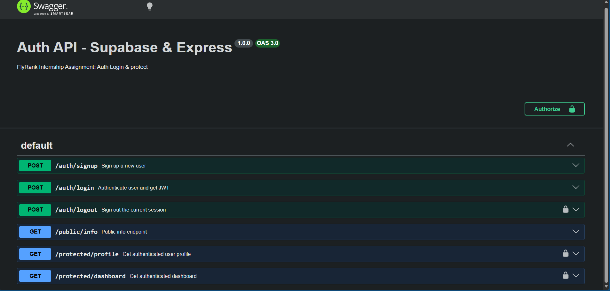

# Supabase Authentication API

A secure REST API handling user authentication (Sign Up, Log In, Log Out) and protected routes using Supabase Auth and Express.

## Setup & Running

1. Copy `.env.example` to `.env`:
   ```bash
   cp .env.example .env
   ```
2. Populate `SUPABASE_URL` and `SUPABASE_KEY` with your project's anon key credentials from Supabase Dashboard.
3. Install dependencies and start:
   ```bash
   pnpm add && node server.js
   ```

## Endpoint Reference

| Method | Endpoint | Auth Required | Description | Status Codes |
|---|---|---|---|---|
| `POST` | `/auth/signup` | No | Register new user account | 201, 400 |
| `POST` | `/auth/login` | No | Authenticate & return JWT tokens | 200, 400, 401 |
| `POST` | `/auth/logout` | Yes (`Bearer <token>`) | Sign out user session | 204, 401 |
| `GET` | `/public/info` | No | Open informational endpoint | 200 |
| `GET` | `/protected/profile`| Yes (`Bearer <token>`) | Retrieve authenticated user metadata | 200, 401 |
| `GET` | `/protected/dashboard`| Yes (`Bearer <token>`) | Protected user dashboard | 200, 401 |
| `GET` | `/docs` | No | Interactive Swagger UI | 200 |

## Sample Terminal Verification

```http
HTTP/1.1 201 Created
X-Powered-By: Express
Content-Type: application/json; charset=utf-8
Content-Length: 1030
ETag: W/"406-ltHjgKpFlq+0WKIF8PqFjARlby0"
Date: Mon, 28 Sep 2026 20:04:39 GMT
Connection: keep-alive
Keep-Alive: timeout=5

{"id":"7523ae9e-14a2-482c-a052-e4be103d62b1","aud":"authenticated","role":"authenticated","email":"testuser@example.com","email_confirmed_at":"2026-09-28T20:04:39.768193648Z","phone":"","last_sign_in_at":"2026-09-28T20:04:39.776334465Z","app_metadata":{"provider":"email","providers":["email"]},"user_metadata":{"email":"testuser@example.com","email_verified":true,"phone_verified":false,"sub":"7523ae9e-14a2-482c-a052-e4be103d62b1"},"identities":[{"identity_id":"a7168e39-3861-4b0d-863b-56c68217f842","id":"7523ae9e-14a2-482c-a052-e4be103d62b1","user_id":"7523ae9e-14a2-482c-a052-e4be103d62b1","identity_data":{"email":"testuser@example.com","email_verified":true,"phone_verified":false,"sub":"7523ae9e-14a2-482c-a052-e4be103d62b1"},"provider":"email","last_sign_in_at":"2026-09-28T20:04:39.759976599Z","created_at":"2026-09-28T20:04:39.760027Z","updated_at":"2026-09-28T20:04:39.760027Z","email":"testuser@example.com"}],"created_at":"2026-09-28T20:04:39.732445Z","updated_at":"2026-09-28T20:04:39.804024Z","is_anonymous":false}
```

## Swagger UI

Interactive documentation with JWT authorization support:

